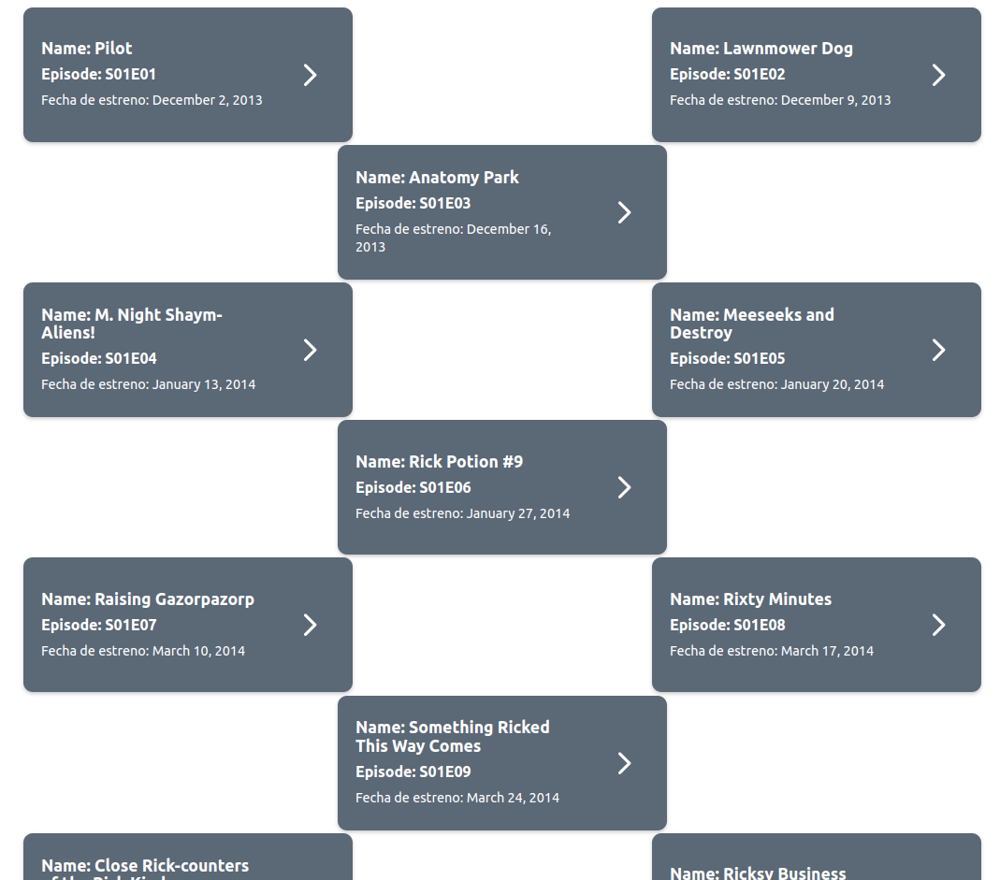
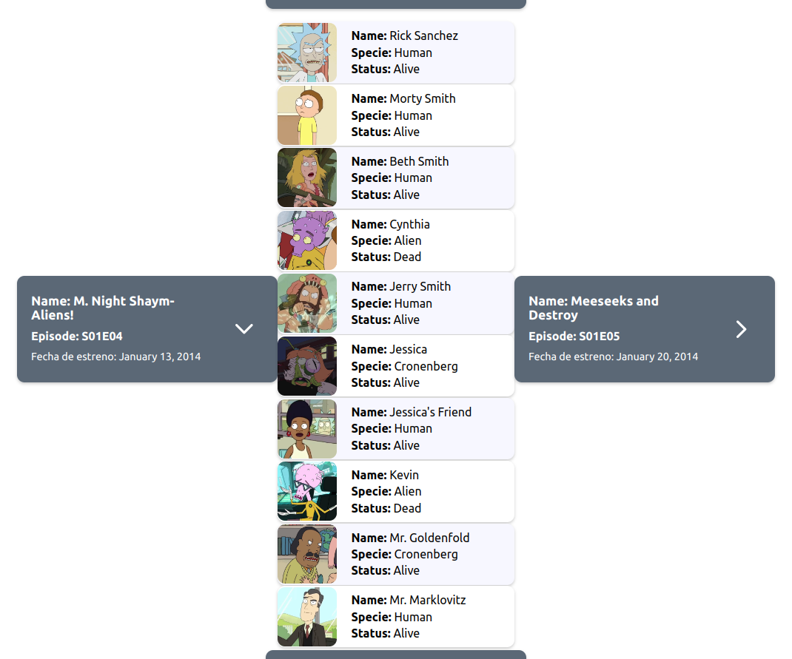
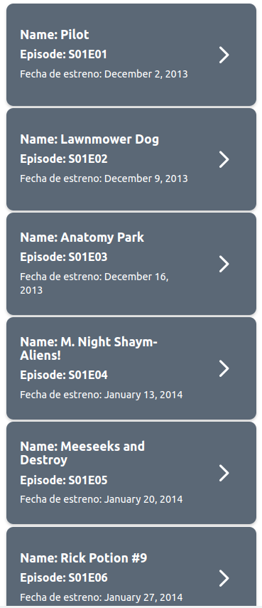
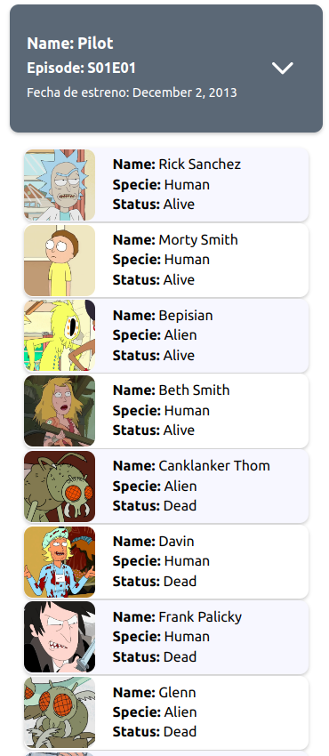

# Rick & Morty API 🧪

## Table of contents :page_facing_up:
- [Overview](#overview)
  - [Installation](#Installation)  
  - [The challenge](#the-challenge)
  - [Screenshot](#screenshot)
- [My process](#my-process)
  - [Built with](#built-with)
  - [What I learned](#what-i-learned)
  - [Continued development](#continued-development)
  - [Useful resources](#useful-resources)
- [Authors](#authors)

## Overview :writing_hand:
This project was developed as part of a pair programming exercise. It involves building a CRUD application using React. The main goal was to utilize React states, specifically `useSWR`, along with libraries like Axios and methods like `Promise.all()` to make individual and parallel API calls to the "Rick and Morty" API. Additionally, the project aimed to enhance skills in using Sass for styling.

### Installation :gear:
To get started with the project, follow these steps:

1. Clone the repository:

```shell
git clone https://github.com/viamazoba/rick_and_morty
```

2. Navigate to the project directory:
```shell
cd rick_and_morty
```
3. Install the dependencies:
```shell
npm install
```

4. Start the application:
```shell
npm run dev
```

### The Challenge :weight_lifting_man:
The challenge of this application was to utilize React states effectively, specifically using useSWR, along with libraries like Axios and methods like Promise.all() for making individual and parallel API calls to the "Rick and Morty" API. Additionally, improving skills in Sass for styling was part of the challenge.

### Screenshot 📷 
Here is a screenshot of the project's interface:

**1. Web View**




**2. Mobile View**




### My Process :mountain:
## Built With :hammer_and_wrench:
The project was built using the following technologies:

- React
- Sass
- Rick and Morty API

### What I Learned :microscope:
During the development of this project, I gained experience in:

- Making individual API calls using Axios.
- Making parallel API calls using Promise.all().
- Implementing React states with useSWR.
- Enhancing styling with Sass.

### Continued Development :briefcase:
In the future, there are plans to improve the Product Manager with the following features:

Implement user authentication to secure product management actions.
Add filtering and search functionalities based on the API to facilitate product exploration.
Enhance the user interface and user experience to make it more intuitive and appealing.

### Useful Resources :sos:
During the development of this project, the following resources were helpful:

Official React documentation: https://reactjs.org/docs
Official Sass documentation: https://sass-lang.com/documentation
Rick and Morty API: https://rickandmortyapi.com/documentation

### Author :nerd_face:
This project was created by viamazoba. You can find my GitHub profile at the following link:
- [viamazoba](https://github.com/viamazoba)